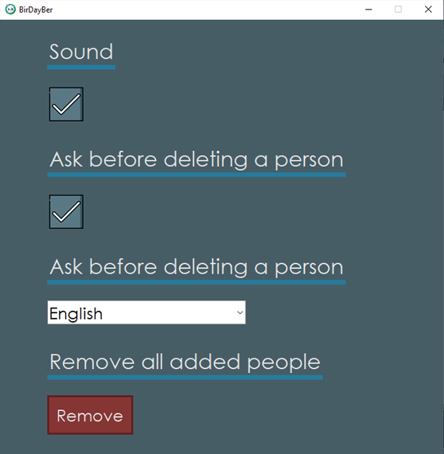

# BirDayBer

### BirDayBer (an abbreviation for "Birthday Reminder") is an application made for people who forget the birthdays of their friends or families like me 😅.

It allows you to add the date of birth and other minimal information to a local database. Then the program will take care of calculating the dates for you.

This project will remind you with a notification for your operating system if it is someone's birthday on the same day or it will notify you if it's soon.

## Technologies used in the project:

- [Python](https://www.python.org/) programming language.
- Python [Tkinter (Tcl/Tk)](https://docs.python.org/3/library/tkinter.html) library.
- Python [Sqlite3](https://docs.python.org/3/library/sqlite3.html) library.
- Python [Pillow](https://pypi.org/project/Pillow/) library.
- Python [PyStray](https://pypi.org/project/pystray/) library.
- Python [Plyer](https://pypi.org/project/plyer/) library.
- Python [PyGame](https://pypi.org/project/pygame/) library.
- Python [OS](https://docs.python.org/3/library/os.html) module.
- Python [WebBrowser](https://rico-schmidt.name/pymotw-3/webbrowser/index.html) module.
- Python [Base64](https://docs.python.org/3/library/base64.html) module.
- Python [DateTime](https://docs.python.org/3/library/datetime.html) module.
- Python [Threading](https://docs.python.org/3/library/threading.html) module.
- Python [Time](https://docs.python.org/3/library/time.html) module.
- Python [Re](https://docs.python.org/3/library/re.html) module.
- Python [Json](https://docs.python.org/3/library/json.html) module.

## Requirements:

- [Python 3.9.6](https://www.python.org/downloads/release/python-396/).
- [Pillow 8.0.1](https://pypi.org/project/Pillow/8.0.1/).
- [PyStray 0.17.3](https://pypi.org/project/pystray/).
- [Plyer 2.0.0](https://pypi.org/project/plyer/).
- [PyGame 2.0.1](https://pypi.org/project/pygame/).
- The rest of libraries and modules come by default.

## How to run:

- You just have to execute the `BirDayBer.py` file.

## Contributions

Pull requests are welcome.
So if you've got an idea of how to improve this code, I'll thank you for
opening an issue to check that change that you want to make.

## Updates

I'll try to be active with this proyect, so I'll be doing what is planificated 
with this one, but that doesn't mean that I couldn't change some ideas of the concept. 

## Credits

- Skull icon from [Freepik (flaticon)](https://www.flaticon.com/free-icon/skull_485605?related_id=485564&origin=search).
- Skull 2 icon from [Freepik (flaticon)](https://www.flaticon.com/free-icon/skull_2327206).
- Party-hat icon from [Freepik (flaticon)](https://www.flaticon.com/free-icon/party-hat_3990692).
- Party-hat 2 icon from [Freepik (flaticon)](https://www.flaticon.com/free-icon/party-hat_4593878).
- Nut icon from [Freepik (flaticon)](https://www.flaticon.com/free-icon/nut_3593739).
- Garbage icon from [Freepik (flaticon)](https://www.flaticon.com/free-icon/garbage_3143497?related_id=3143497&origin=search).
- GitHub icon from [Freepik (flaticon)](https://www.flaticon.com/free-icon/github_1051275).
- Twitter icon from [Freepik (flaticon)](https://www.flaticon.com/free-icon/twitter_185961).
- Linkedin icon from [Freepik (flaticon)](https://www.flaticon.com/free-icon/linkedin_185964).
- User icon from [Freepik (flaticon)](https://www.flaticon.com/free-icon/user_747376).
- Male icon from [Freepik (flaticon)](https://www.flaticon.com/free-icon/man_2284900?related_id=2284900&origin=search).
- Female icon from [Freepik (flaticon)](https://www.flaticon.com/free-icon/woman_2284897).
- Minimize button icon from [Freepik (flaticon)](https://www.flaticon.com/free-icon/minimise-button_74888).
- Radio button icon [Freepik (flaticon)](https://www.flaticon.com/free-icon/radio-button_3305917?term=radio%20button&page=1&position=8&page=1&position=8&related_id=3305917&origin=search).
- Accept button icon from [Freepik (flaticon)](https://www.flaticon.com/free-icon/yes_3572255).
- Clear button icon from [Freepik (flaticon)](https://www.flaticon.com/free-icon/loading_1177586).
- Check button icon from [Freepik (flaticon)](https://www.flaticon.com/free-icon/square_594577?related_id=594577&origin=search).
- Privacy Policy icon from [Freepik (flaticon)](https://www.flaticon.com/free-icon/compliant_4252354?related_id=4252365&origin=search).
- Terms and Conditions icon from [monklk (flaticon)](https://www.flaticon.com/free-icon/terms-and-conditions_2234784?related_id=2234821&origin=search).
- Maximized & Maximize buttons icon from [Pixel Perfect (flaticon)](https://www.flaticon.com/free-icon/move_2749235?related_id=2749235&origin=search).
- Close button icon from [Pixel Perfect (flaticon)](https://www.flaticon.com/free-icon/close_1828778?related_id=1828778&origin=search).
- Edit icon from [Becris (flaticon)](https://www.flaticon.com/free-icon/edit_860814?term=edit&.page=1&position=4&page=1&position=4&related_id=860814&origin=search).
- User icon from [DinosoftLabs (flaticon)](https://www.flaticon.com/free-icon/user_4018596).
- Court icon from [Nikita Golubev (flaticon)](https://www.flaticon.com/free-icon/court_1750412?related_id=1750530&origin=search).
- Update button icon from [Google (flaticon)](https://www.flaticon.com/free-icon/tick-inside-circle_61222)
- Sound effects from [Zapsplat](https://www.zapsplat.com/) and [mixkit](https://mixkit.co/).

## Project Status:

### `Available on Windows`
### `Version: 1.1.2`

## License

#### MIT © [Luciano Esteban](https://github.com/LucioFex)
